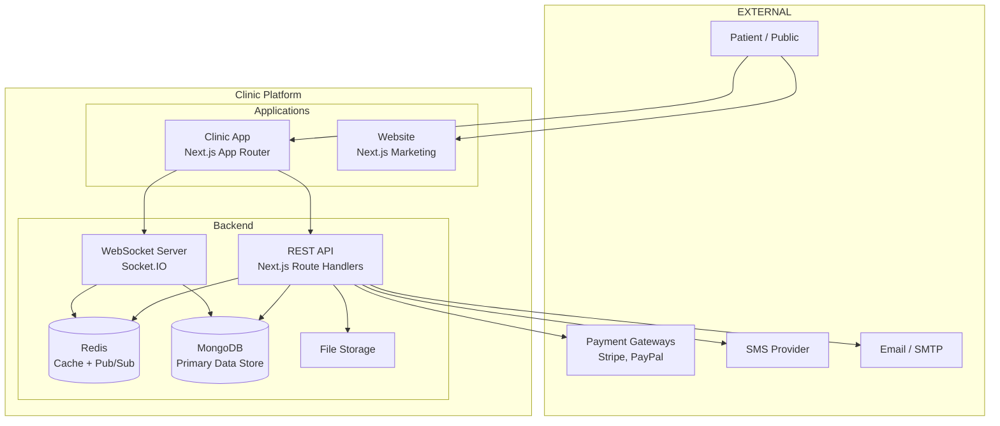
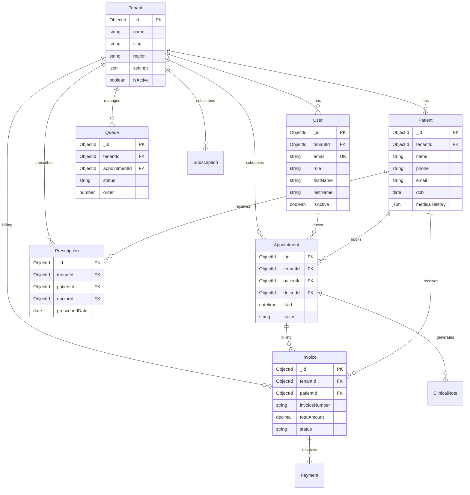
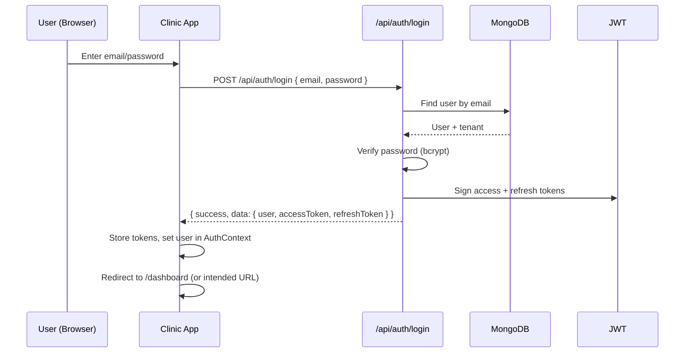
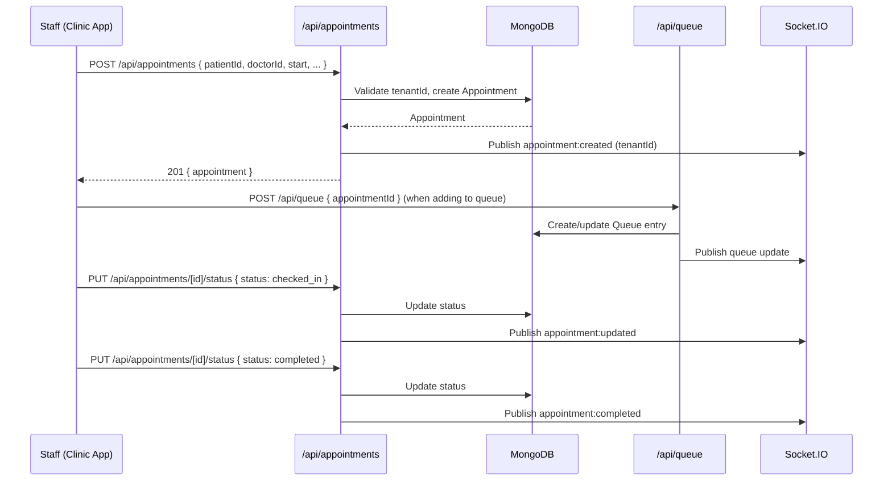
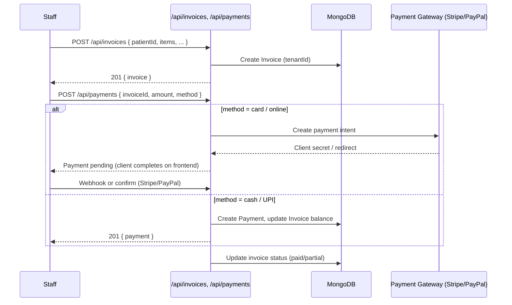
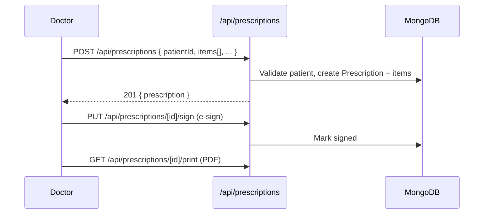
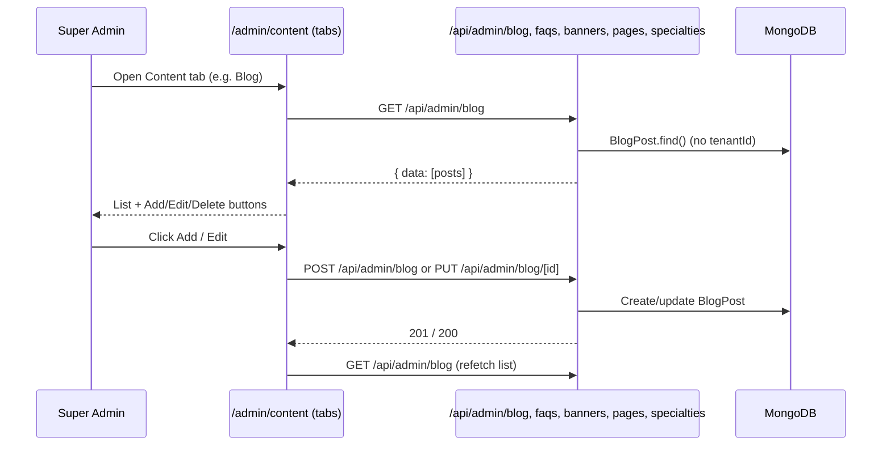
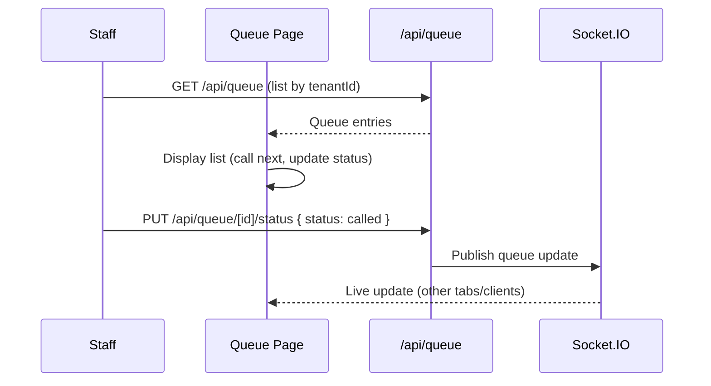
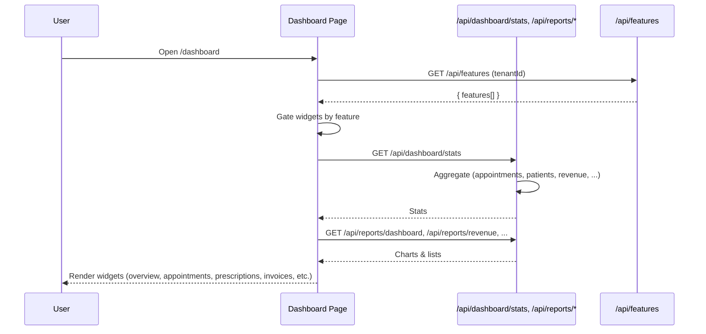

# Full Platform Point-to-Point Report

**Document version:** 1.0  
**Scope:** Clinic Management Platform (Clinic App + Website)  
**Source of truth:** CursorMD/New (clinic-complete-specification.md, clinic-dashboard-architecture.mermaid, database-schema.mermaid, realtime-caching-strategy.md)

---

## 1. Executive Summary

The platform is a **multi-tenant clinic management system** with two main applications:

| Application    | Purpose                                                                                                                                                                           | Users                                                        |
| -------------- | --------------------------------------------------------------------------------------------------------------------------------------------------------------------------------- | ------------------------------------------------------------ |
| **Clinic App** | Dashboard for clinic staff (Super Admin, Doctor, Admin, Manager, staff roles). Appointments, patients, prescriptions, billing, inventory, reports, queue, telemedicine, settings. | Clinic staff only (no patient self-service in current scope) |
| **Website**    | Marketing site: About, Contact, Pricing, Blog, Legal (Terms, Privacy), Support.                                                                                                   | Public + clinic staff (login/register links)                 |

**Key characteristics:**

- **Multi-tenant:** All data scoped by `tenantId` (except platform-level entities like Specialty, BlogPost, FAQ, Banner, ContentPage).
- **Role-based access:** Super Admin (full system), Doctor (clinic owner), Admin (full clinic operations), Manager (limited), plus Nurse, Receptionist, Accountant, Pharmacist.
- **API-first:** All features exposed via REST APIs; future mobile apps can consume the same APIs.
- **Real-time:** Socket.IO + Redis pub/sub for live updates (queue, appointments, notifications).
- **Compliance:** HIPAA/GDPR-aware; PHI encrypted; audit logs; no PHI in logs/URLs/notifications.

---

## 2. System Context Diagram



---

## 3. High-Level Architecture

```mermaid
flowchart TB
    subgraph ROLES["User Roles"]
        SA[Super Admin]
        DOC[Doctor]
        ADM[Admin]
        MGR[Manager]
        STAFF[Staff: Nurse, Receptionist, Accountant, Pharmacist]
    end

    subgraph CLINIC_APP["Clinic App (Next.js)"]
        PAGES[Pages / App Router]
        LAYOUT[Layout + Sidebar]
        AUTH[Auth Context]
        FEATURES[Feature Context]
        PERMS[Permission Matrix]
    end

    subgraph API_LAYER["API Layer"]
        AUTH_API[/api/auth]
        CLINIC_API[/api/patients, appointments, prescriptions, invoices, ...]
        ADMIN_API[/api/admin/*]
        SETTINGS_API[/api/settings]
        REPORTS_API[/api/reports]
    end

    subgraph DATA["Data & Real-Time"]
        MONGO[(MongoDB)]
        REDIS[(Redis)]
        SOCKET[Socket.IO]
    end

    ROLES --> PAGES
    PAGES --> LAYOUT
    AUTH --> PERMS
    FEATURES --> PERMS
    PAGES --> API_LAYER
    API_LAYER --> MONGO
    API_LAYER --> REDIS
    SOCKET --> REDIS
    CLINIC_APP --> SOCKET
```

---

## 4. Application Structure

### 4.1 Monorepo Layout

```
clinic/
├── apps/
│   ├── clinic/          # Clinic dashboard (staff-only)
│   │   ├── app/         # Next.js App Router
│   │   ├── components/
│   │   ├── contexts/
│   │   ├── lib/
│   │   ├── models/
│   │   ├── services/
│   │   ├── middleware/
│   │   └── public/
│   └── website/         # Marketing website
│       ├── app/
│       └── components/
├── packages/            # Shared (if any)
└── CursorMD/            # Specs & docs
```

### 4.2 Clinic App – Route Structure

| Segment                                                       | Purpose                                                                                       |
| ------------------------------------------------------------- | --------------------------------------------------------------------------------------------- |
| `/`                                                           | Landing / redirect (e.g. to login or dashboard)                                               |
| `/login`, `/register`                                         | Auth                                                                                          |
| `/dashboard`                                                  | Main dashboard (role-specific widgets)                                                        |
| `/appointments`, `/appointments/new`, `/appointments/[id]`    | Appointments                                                                                  |
| `/patients`, `/patients/[id]`                                 | Patient management                                                                            |
| `/prescriptions`, `/prescriptions/new`, `/prescriptions/[id]` | Prescriptions                                                                                 |
| `/invoices`, `/invoices/new`, `/invoices/[id]`                | Invoicing                                                                                     |
| `/queue`                                                      | Patient queue                                                                                 |
| `/inventory`, `/inventory/items`, `/inventory/lots`           | Inventory                                                                                     |
| `/reports`                                                    | Reports & analytics                                                                           |
| `/staff`                                                      | Staff management                                                                              |
| `/settings`                                                   | Clinic settings (tabs: general, compliance, doctors, hours, queue, tax, SMTP, holidays, etc.) |
| `/subscription`                                               | Tenant subscription (plans, return, cancel)                                                   |
| `/telemedicine`, `/telemedicine/[id]`                         | Video consultations                                                                           |
| `/admin`                                                      | **Super Admin only:** system dashboard                                                        |
| `/admin/clients`                                              | Tenant management                                                                             |
| `/admin/subscriptions`                                        | Subscription plans                                                                            |
| `/admin/users`                                                | All users                                                                                     |
| `/admin/content`                                              | **Tabs:** Specialties, Blog, FAQs, Static Pages, Banners                                      |
| `/admin/financial`                                            | **Tabs:** Revenue, Disputes, Settlements, Commission, Invoicing                               |
| `/admin/patients`, `/admin/appointments`, `/admin/doctors`    | Admin views                                                                                   |
| `/admin/reports`, `/admin/analytics`, `/admin/activity-logs`  | Admin reports & logs                                                                          |
| `/admin/settings`, `/admin/create-admin`                      | Admin settings & create admin                                                                 |

### 4.3 Website – Route Structure

| Route                          | Purpose        |
| ------------------------------ | -------------- |
| `/`                            | Home           |
| `/about`, `/contact`           | Static pages   |
| `/pricing`                     | Pricing plans  |
| `/blog`, `/blog/[slug]`        | Blog           |
| `/legal`                       | Legal hub      |
| `/terms`, `/privacy`           | Terms, Privacy |
| `/support`, `/support/contact` | Support        |

---

## 5. Role & Permission Matrix (Summary)

| Role                     | Scope         | Key Capabilities                                                                                     |
| ------------------------ | ------------- | ---------------------------------------------------------------------------------------------------- |
| **Super Admin**          | Platform-wide | All clinics, subscriptions, system logs, admin content/financial, create admin                       |
| **Doctor**               | Single tenant | Full clinic: appointments, patients, prescriptions, billing, staff, settings, assign Admin/Manager   |
| **Admin (Clinic Admin)** | Single tenant | Full clinic operations; edit settings, billing, staff (add/edit/delete); cannot assign Admin/Manager |
| **Manager**              | Single tenant | View appointments, add/edit patients, book, basic billing, view reports, reception tasks             |
| **Staff**                | Single tenant | Nurse, Receptionist, Accountant, Pharmacist – permissions per clinic-complete-specification.md       |

Permission checks use `lib/permissions/constants.js` (RESOURCES, ACTIONS, PERMISSIONS) and `lib/permissions/cursor-md-matrix.js` (e.g. `canEditClinicSettings`, `canAssignAdminManager`). All API routes enforce auth and role/resource checks.

---

## 6. Data Model (Entities)



**Platform-level (no tenantId):** Specialty, BlogPost, FAQ, Banner, ContentPage, SubscriptionPlan, SystemSettings.  
**Tenant-scoped (tenantId required):** User, Patient, Appointment, Invoice, Payment, Prescription, ClinicalNote, Queue, InventoryItem, LabOrder, Referral, TelemedicineSession, Subscription, etc.

---

## 7. Point-to-Point Flows

### 7.1 Authentication Flow



**Related APIs:** `/api/auth/login`, `/api/auth/refresh`, `/api/auth/me`, `/api/auth/logout`, `/api/auth/register`, `/api/auth/forgot-password`, `/api/auth/reset-password`, `/api/auth/change-password`, `/api/auth/2fa/*`, `/api/auth/oauth/*`.

---

### 7.2 Appointment Lifecycle (Create → Check-in → Complete)



**APIs:** `GET/POST /api/appointments`, `GET/PUT /api/appointments/[id]`, `PUT /api/appointments/[id]/status`, `GET /api/appointments/slots`, `GET/POST/PUT /api/queue`, `GET/PUT /api/queue/[id]/status`.

---

### 7.3 Billing Flow (Invoice → Payment)



**APIs:** `GET/POST/PUT /api/invoices`, `GET/PUT /api/invoices/[id]`, `GET/POST /api/payments`, `POST /api/webhooks/stripe`, `POST /api/webhooks/paypal`.

---

### 7.4 Prescription Flow



**APIs:** `GET/POST/PUT /api/prescriptions`, `GET/PUT /api/prescriptions/[id]`, `PUT /api/prescriptions/[id]/activate`, `PUT /api/prescriptions/[id]/sign`, `PUT /api/prescriptions/[id]/dispense`, `POST /api/prescriptions/check-interactions`.

---

### 7.5 Super Admin – Content Management Flow



**Content tabs:** Specialties, Blog, FAQs, Static Pages, Banners. Each has list + create/update/delete via `/api/admin/specialties`, `/api/admin/blog`, `/api/admin/faqs`, `/api/admin/banners`, `/api/admin/pages`.

---

### 7.6 Queue Flow



**APIs:** `GET/POST/PUT /api/queue`, `GET/PUT /api/queue/[id]`, `PUT /api/queue/[id]/status`.

---

### 7.7 Dashboard Data Flow



---

## 8. API Structure (Grouped)

| Group                   | Path prefix                                                                                                      | Description                                                                                                                                                                                                    |
| ----------------------- | ---------------------------------------------------------------------------------------------------------------- | -------------------------------------------------------------------------------------------------------------------------------------------------------------------------------------------------------------- |
| **Auth**                | `/api/auth/*`                                                                                                    | login, logout, refresh, me, register, forgot-password, reset-password, change-password, 2fa, oauth                                                                                                             |
| **Clinic core**         | `/api/patients`, `/api/appointments`, `/api/prescriptions`, `/api/invoices`, `/api/payments`                     | CRUD + nested routes                                                                                                                                                                                           |
| **Queue**               | `/api/queue`                                                                                                     | List, create, update, status                                                                                                                                                                                   |
| **Inventory**           | `/api/inventory/items`, `lots`, `batches`, `suppliers`, `transactions`                                           | Items, lots, batches, suppliers                                                                                                                                                                                |
| **Reports**             | `/api/reports/dashboard`, `revenue`, `patients`, `appointments`, `departments`, `doctors`, `inventory`           | Analytics                                                                                                                                                                                                      |
| **Settings**            | `/api/settings`                                                                                                  | GET/PUT tenant settings                                                                                                                                                                                        |
| **Users & staff**       | `/api/users`, `/api/doctors`, `/api/departments`                                                                 | Staff management                                                                                                                                                                                               |
| **Clinical**            | `/api/clinical-notes`, `/api/lab-orders`, `/api/lab-results`, `/api/lab-tests`, `/api/imaging`, `/api/referrals` | Clinical data                                                                                                                                                                                                  |
| **Notifications**       | `/api/notifications`, `/api/notification-templates`, `/api/messages`                                             | Notifications & templates                                                                                                                                                                                      |
| **Telemedicine**        | `/api/telemedicine/sessions`, `signaling`                                                                        | Video sessions & signaling                                                                                                                                                                                     |
| **Subscription**        | `/api/subscriptions`, `/api/subscription-plans`, `/api/features`                                                 | Tenant subscription & feature flags                                                                                                                                                                            |
| **Admin (Super Admin)** | `/api/admin/*`                                                                                                   | stats, clients, users, patients, appointments, doctors, content (blog, faqs, banners, pages, specialties), financial (revenue, disputes), analytics, activity-logs, settings, subscription-plans, ip-whitelist |
| **GDPR**                | `/api/gdpr/export`, `delete`, `anonymize`, `rectify`                                                             | Data subject requests                                                                                                                                                                                          |
| **Other**               | `/api/health`, `/api/search`, `/api/batch`, `/api/socket`, `/api/sse`, `/api/reminders/process`                  | Health, search, batch, real-time, reminders                                                                                                                                                                    |

All tenant-scoped APIs validate `tenantId` from the authenticated user; admin APIs enforce `role === 'super_admin'` where required.

---

## 9. Real-Time & Caching

- **Socket.IO:** Authenticated connection; client subscribes by `tenantId` (and optionally entity). Server publishes events (e.g. `appointment:created`, `queue:updated`) via Redis pub/sub so all server instances receive them.
- **Redis:** Cache for hot data (e.g. feature flags, session); pub/sub for Socket.IO scaling.
- **Events (examples):** `appointment:created|updated|cancelled`, `patient:registered|updated`, `payment:received`, `queue:updated`, `notification:new`, `dashboard:refresh`.

See `CursorMD/New/realtime-caching-strategy.md` for full event list and cache keys.

---

## 10. Security & Compliance

| Area                 | Implementation                                                                                                                              |
| -------------------- | ------------------------------------------------------------------------------------------------------------------------------------------- |
| **Auth**             | JWT access + refresh; optional 2FA; OAuth (Google); magic link; rate limiting on auth routes                                                |
| **Tenant isolation** | All queries filter by `tenantId`; admin APIs for Super Admin only                                                                           |
| **PHI**              | No PHI in logs, URLs, or notifications; encrypt sensitive fields where required; audit logs for create/update/delete on sensitive resources |
| **Input**            | Validation (e.g. Zod/Joi) on API inputs; sanitization to prevent injection                                                                  |
| **RBAC**             | Permission matrix (RESOURCES × ACTIONS) per role; `requirePermission` and capability helpers (`canEditClinicSettings`, etc.) on API and UI  |
| **GDPR**             | Export, delete, anonymize, rectify via `/api/gdpr/*`; consent tracking where applicable                                                     |

---

## 11. Tech Stack & Deployment

| Layer               | Technology                                                    |
| ------------------- | ------------------------------------------------------------- |
| **Frontend**        | Next.js (App Router), React, Tailwind CSS, Framer Motion      |
| **Backend**         | Next.js Route Handlers (API routes), Node.js server           |
| **Database**        | MongoDB (Mongoose models)                                     |
| **Cache / Pub-Sub** | Redis                                                         |
| **Real-time**       | Socket.IO                                                     |
| **Auth**            | JWT, bcrypt, optional Passport/OAuth                          |
| **File storage**    | Configurable (local or cloud)                                 |
| **Payments**        | Stripe, PayPal (webhooks)                                     |
| **i18n**            | Context-based; locales in `lib/i18n/locales` (en, ar, es, fr) |

**Deployment:** Next.js app can be deployed to Vercel, Node server, or Docker; MongoDB and Redis as managed or self-hosted services.

---

## 12. Document Index

| Section | Content                                                                                          |
| ------- | ------------------------------------------------------------------------------------------------ |
| §1      | Executive summary                                                                                |
| §2      | System context diagram                                                                           |
| §3      | High-level architecture                                                                          |
| §4      | Application structure (monorepo, clinic routes, website routes)                                  |
| §5      | Role & permission matrix summary                                                                 |
| §6      | Data model (entities + diagram)                                                                  |
| §7      | Point-to-point flows (auth, appointment, billing, prescription, admin content, queue, dashboard) |
| §8      | API structure (grouped)                                                                          |
| §9      | Real-time & caching                                                                              |
| §10     | Security & compliance                                                                            |
| §11     | Tech stack & deployment                                                                          |

For detailed permission matrix and feature specs, see **CursorMD/New/clinic-complete-specification.md**.  
For dashboard and module architecture, see **CursorMD/New/clinic-dashboard-architecture.mermaid**.  
For database schema, see **CursorMD/New/database-schema.mermaid**.  
For real-time events and cache strategy, see **CursorMD/New/realtime-caching-strategy.md**.
